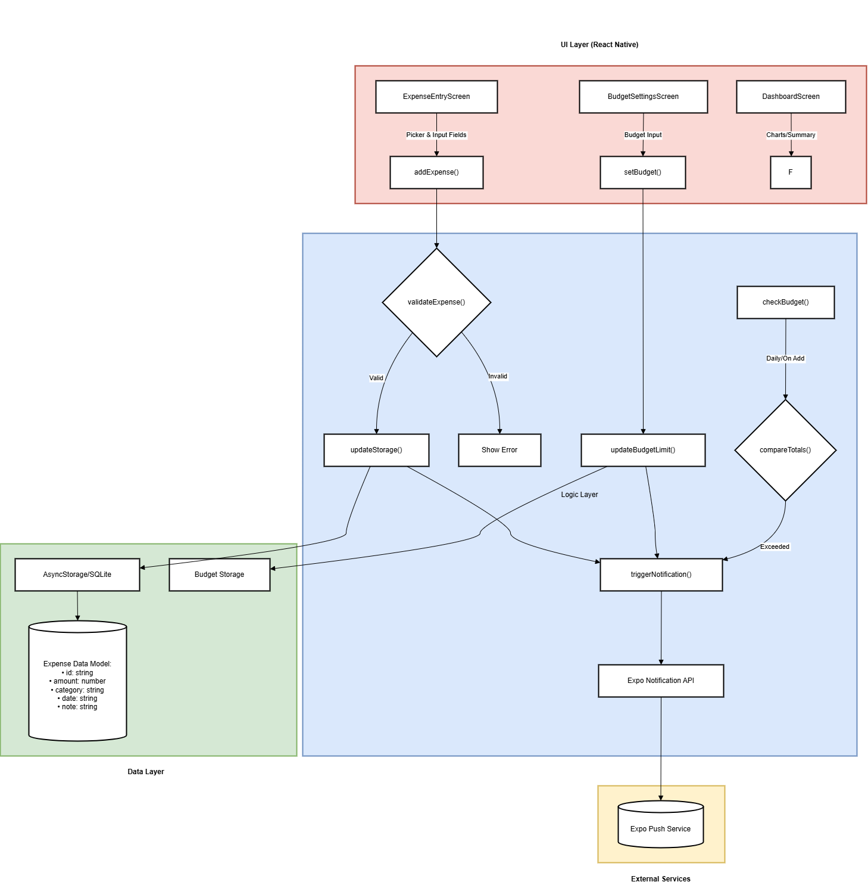

Figure 1 shows the overall architecture of the Kopi Money application. The system follows a layered design: a UI Layer (React Native screens), a Logic Layer (business logic and notification triggers), and a Data Layer (local storage).

Figure 1: System architecture for the Budget Tracker module (UI components, logic, and storage).
In Figure 1, the mobile app’s UI consists of components for expense entry (picker and input fields), budget settings, and the dashboard. These components dispatch actions to the logic layer. For example, the ExpenseEntryScreen component collects user input and calls an addExpense() function. The logic layer validates the data, updates the storage, and triggers a push notification. The Storage Layer uses AsyncStorage (or SQLite) to save expense objects. Each expense has a schema (see Table 1) containing fields like category, amount, date, and description.
Notification triggers are handled in the logic layer: after saving a new expense, the app immediately invokes the Expo notification API to display a confirmation message (“Expense added successfully”). The app also maintains running totals: it sums all saved expenses in the current month and compares it to the user-set budget. If the total exceeds the limit, the logic triggers an “Over Budget” notification. This check can happen every time an expense is added or via a daily background check. The architecture allows easy extension; for example, a future backend service could sync data to the cloud, or a SQLite database could replace AsyncStorage without affecting the UI components.
Table 1 summarizes the data model for an expense record:
Field Type Description
id string Unique identifier (UUID)
amount number Expense amount
category string Expense type/category (e.g. "Food")
date string ISO date string of the expense
note string? Optional description or note
Table 1: Expense data model interface (TypeScript).
In summary, the architecture decouples the UI (presentation) from storage and logic. The notification module (within logic) interacts with Expo’s push service, using the device’s push token. Overall, this design ensures that adding a new expense reliably updates storage, triggers notifications, and updates the dashboard with new data.
